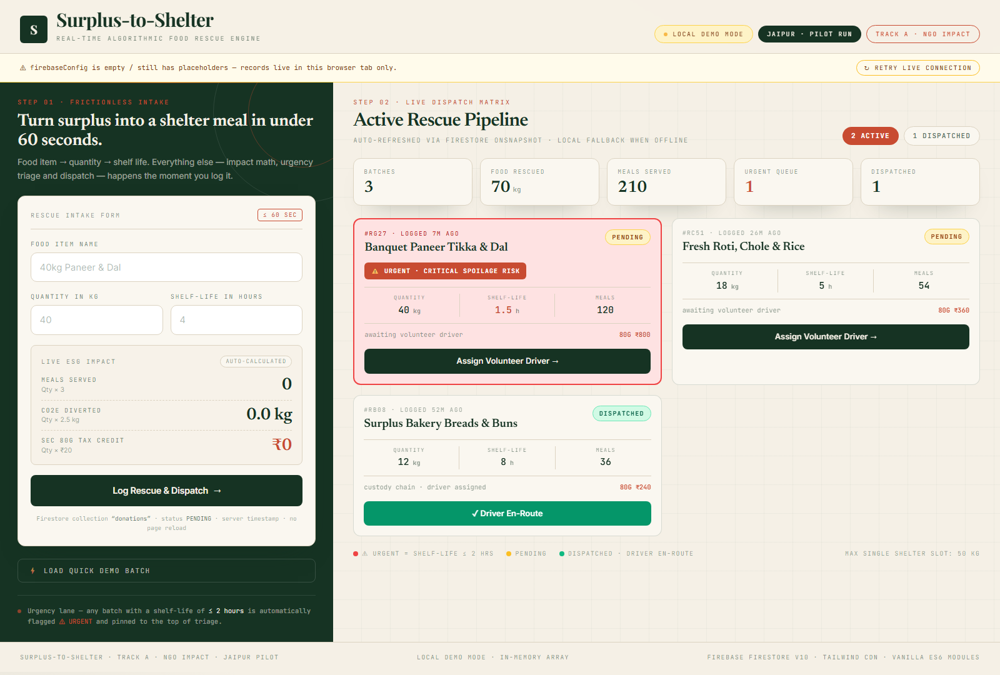

# Surplus-to-Shelter

**Real-time algorithmic food rescue engine** — restaurants, banquets and bakeries log surplus food in under 60 seconds; the system triages spoilage risk, calculates ESG impact live, and dispatches volunteer drivers to shelters.

[](https://sahilkathat01.github.io/surplus-to-shelter/)
[](https://firebase.google.com/)
[](https://tailwindcss.com/)
[](#-quick-start)
[](#project-status)

**▶ Live app:** https://sahilkathat01.github.io/surplus-to-shelter/ · **📦 Downloads (PPTX/PDF):** https://sahilkathat01.github.io/surplus-to-shelter/downloads.html



---

## Why this exists

Roughly a third of all food produced is wasted while shelters struggle to feed people every night. UNEP's Food Waste Index estimates on the order of **a billion tonnes of food wasted annually** — most of it still perfectly edible at the moment it is thrown out.

The gap is not food, it is **time and coordination**. Surplus is discovered hours before it spoils, and nobody knows which shelter can receive it, who will drive it, or how much impact the rescue created.

Surplus-to-Shelter closes that loop in a single screen:

**Log → Triage → Dispatch → Impact.**

## Features

- **Frictionless 60-second intake** — Food item, quantity (kg), shelf-life (hrs). That's it. No multi-step forms.
- **Live ESG calculator** — Meals, CO₂e diverted and Sec 80G tax credit update keystroke-by-keystroke as the operator types the quantity.
- **Automatic spoilage triage** — Any batch with **≤ 2 hours** shelf-life flips to a red **⚠ URGENT · CRITICAL SPOILAGE RISK** card with a thick terracotta border and is impossible to miss.
- **Dispatch lifecycle** — `PENDING` (amber) → *Assign Volunteer Driver* → `DISPATCHED` with a locked green **✓ Driver En-Route** button. Status is written back to Firestore so every connected device sees it instantly.
- **Real-time sync** — Firestore `onSnapshot` keeps the whole pipeline live across devices: kitchen tablet, dispatcher laptop, NGO dashboard.
- **Offline / demo fallback** — Leave `firebaseConfig` empty (or as placeholders) and the app boots into a seeded **local demo mode**. No backend needed for a demo, a pitch or a hackathon judge.
- **Input safety** — Expired batches are rejected, quantity must be positive, numbers are validated, and the page **never reloads** on submit (single-page app behaviour with plain ES6 modules).
- **12-column command center layout** — dark forest-green intake rail (col-4) + live rescue matrix (col-8), fully responsive down to mobile.
- **Editorial design system** — warm cream canvas, deep forest green, rust terracotta accents, serif display type and monospace data labels. Deliberately **not** the default blue/white dashboard look.

## Live ESG formulas

| Metric | Formula | Where it appears |
|---|---|---|
| Meals served | `Quantity (kg) × 3` | Intake widget + pipeline stats |
| CO₂e diverted | `Quantity (kg) × 2.5 kg` | Intake widget |
| Sec 80G tax credit | `Quantity (kg) × ₹20` | Intake widget + every rescue card |

> **Note:** the ₹20/kg figure is a **configurable impact-value proxy** used for impact reporting — it is *not* the statutory Section 80G deduction rate. For production use, swap it for your organisation's approved valuation.

## Tech stack

| Layer | Choice | Why |
|---|---|---|
| Markup / logic | Single `index.html`, vanilla **ES6 modules** | Zero build step, opens by double-click |
| Styling | **Tailwind CSS via CDN** + hand-written palette CSS | Fast, themeable, no bundler |
| Type | Google Fonts — *Inter*, *Newsreader*, *Playfair Display*, *JetBrains Mono* | Editorial serif headings + monospace data |
| Backend | **Firebase Firestore v10** (modular CDN imports) | Real-time `onSnapshot`, server timestamps, no server code |
| Fallback | In-memory array + seeded records | Works with no credentials, offline or on stage |

**No React. No Node. No Vite. No npm. No API keys required to demo.**

## Quick start

**Option 1 — just run it (demo mode):**

1. Download [`index.html`](index.html)
2. Double-click it. Done — seeded demo records, full interactivity, zero setup.

**Option 2 — serve locally:**

```bash
python -m http.server 8000
# open http://localhost:8000
```

## Go live with Firebase (2 minutes)

1. Create a project at [console.firebase.google.com](https://console.firebase.google.com/) → add a **Web app** → copy the config object.
2. Open `index.html`, scroll to the top of the `<script type="module">` block and fill in the visible `firebaseConfig`:

```js
const firebaseConfig = {
  apiKey: "…",
  authDomain: "your-app.firebaseapp.com",
  projectId: "your-app",
  storageBucket: "your-app.appspot.com",
  messagingSenderId: "…",
  appId: "…"
};
```

3. Enable **Cloud Firestore** in the console.
4. If you deploy to GitHub Pages, add your domain under
   **Authentication → Settings → Authorized domains** (e.g. `your-user.github.io`).
5. Start with permissive rules for the pilot, then lock them down:

```
rules_version = '2';
service cloud.firestore {
  match /databases/{database}/documents {
    match /donations/{doc} {
      // Pilot rules — replace before production
      allow read, write: if true;
    }
  }
}
```

With a valid config the header chip switches from **LOCAL DEMO MODE** to **FIRESTORE LIVE** and every log/dispatch propagates in real time. Any config failure (offline, bad credentials, denied rules) falls back to demo mode with an explanatory banner instead of breaking.

## Data model — `donations` collection

| Field | Type | Description |
|---|---|---|
| `item` | string | Food item name, e.g. `40kg Paneer & Dal` |
| `qty` | number | Quantity in kilograms |
| `expiryHours` | number | Shelf-life window; `≤ 2` marks the card URGENT |
| `status` | string | `PENDING` → `DISPATCHED` |
| `meals` | number | `qty × 3` |
| `co2e` | number | `qty × 2.5` kg |
| `tax` | number | `qty × 20` (₹, impact proxy) |
| `createdAt` | timestamp | Firestore server timestamp |
| `dispatchedAt` | timestamp | Set on dispatch (server timestamp) |

## Design system

| Token | Hex | Role |
|---|---|---|
| Canvas cream | `#F5F0E6` / `#EFE9DC` | Page background |
| Paper | `#FAF7F0` | Cards, intake surface |
| Deep forest green | `#163323` / `#1E3F2E` | Dark primary, headings, submit CTA |
| Rust terracotta | `#C84B31` / `#D9532F` | Urgency accent, eyebrows, highlights |
| Sand borders | `#DCD3C1` / `#D5CCA8` | Hairlines, dividers, inputs |

## Repository contents

```
index.html                          ← the app (single file, everything inline)
downloads.html                      ← landing page with PPTX/PDF download buttons
surplus-to-shelter-pitch-deck.html  ← browser pitch deck (source)
surplus-to-shelter-pitch-deck.pdf   ← exported pitch deck
Surplus-to-Shelter-6-slide-pitch-deck.pptx / .pdf
1to9finalpdfsfs.pptx                ← converted presentation
build-surplus-deck.ps1              ← deck generator script
convert-pdf-to-ppt.ps1              ← PDF → PPTX converter
assets/                             ← screenshots & slide renders
```

## Project status

**Jaipur pilot · Track A · NGO Impact.** MVP complete and deployed: intake, real-time triage, dispatch lifecycle, ESG accounting and demo fallback are all working end-to-end.

**Next up:** donor & shelter accounts, route optimisation on a map, machine-readable Sec 80G receipts, and capacity guardrails per shelter (50 kg slots).

---

Built for impact, not just a demo — if it helps your shelter network, ⭐ star the repo and send a PR.
